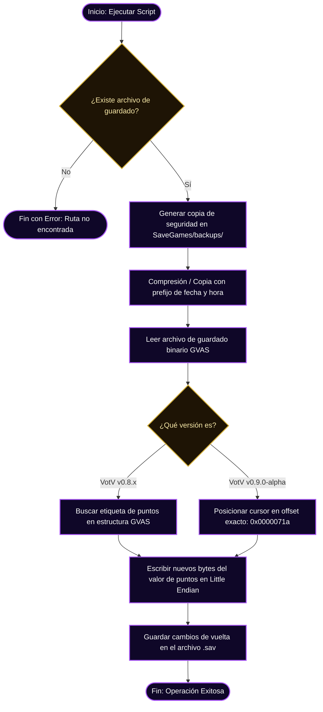

# VotV Points Editor — Editor de Puntos para Voices of the Void

<p align="center">
  
</p>

Una herramienta de modding local, rápida y segura escrita en Python para editar los puntos del jugador y gestionar copias de seguridad de las partidas en el juego de simulación y horror **[Voices of the Void](https://mrdrnose.itch.io/votv)**.

---

## 🛠️ Flujo Seguro de Modificación y Respaldos

Para evitar corromper las partidas de Unreal Engine (formato binario GVAS), el editor ejecuta un protocolo estricto de seguridad. El siguiente diagrama ilustra el flujo desde la ejecución del comando hasta la confirmación de la escritura física:



---

## 🕹️ Versiones Compatibles y Detalles Técnicos

Voices of the Void ha cambiado su motor de serialización entre versiones alpha, por lo que el editor se divide en dos módulos específicos:

### 1. [Versión 0.8.x](file:///C:/Users/pablo/Documentos/GitHub/VotV-Points-Editor/v0.8.x/) (Totalmente Estable)
*   **Archivos de Partida:** Modifica `data.sav` y las partidas individuales (`s_*.sav`).
*   **Funcionamiento:** Realiza un escaneo del archivo binario buscando la firma de la propiedad de puntos de la estructura serializada de Unreal Engine. Esto permite modificar los puntos dinámicamente sin importar el tamaño exacto del archivo.
*   **Enlace:** [Documentación Técnica v0.8.x](file:///C:/Users/pablo/Documentos/GitHub/VotV-Points-Editor/v0.8.x/README.md)

### 2. [Versión 0.9.0 Alpha](file:///C:/Users/pablo/Documentos/GitHub/VotV-Points-Editor/v0.9.0-alpha/) (Estable para la versión Unstable)
*   **Archivos de Partida:** Modifica `data.sav` y partidas individuales (`s_*.sav`).
*   **Offset Técnico:** Descubierto y fijado en el offset binario absoluto `0x0000071a`.
*   **Funcionamiento:** Escribe directamente el entero de 32 bits correspondiente a los puntos deseados (probado con éxito hasta 2,000,000 puntos) en el offset binario exacto utilizado por la build 0.9.0-alpha.
*   **Enlace:** [Investigación Técnica de Offsets v0.9.0](file:///C:/Users/pablo/Documentos/GitHub/VotV-Points-Editor/v0.9.0-alpha/README.md)

---

## 📂 Estructura del Repositorio

El repositorio se organiza jerárquicamente para separar los scripts funcionales, el historial de ingeniería inversa de offsets y las utilidades de backups:

```text
VotV-Points-Editor/
|-- [v0.8.x/](file:///C:/Users/pablo/Documentos/GitHub/VotV-Points-Editor/v0.8.x/)                          # Canal de soporte estable para VotV 0.8.x
|   |-- set_puntos.py                   # Script CLI para modificar puntos
|   |-- modificar_puntos.py             # Script interactivo por consola
|   |-- PRUEBA_RAPIDA.bat               # Launcher rápido para Windows (otorga 50K puntos)
|   `-- README.md                       # Detalles de la versión 0.8.x
|-- [v0.9.0-alpha/](file:///C:/Users/pablo/Documentos/GitHub/VotV-Points-Editor/v0.9.0-alpha/)                    # Canal experimental/funcional para VotV 0.9.0
|   |-- set_puntos.py                   # Script principal adaptado al offset 0x71a
|   |-- README.md                       # Detalles y límites del parche en v0.9.0
|   `-- investigacion/                  # Bitácoras de análisis hexadecimal y búsqueda de firmas
|-- [utilidades-backups/](file:///C:/Users/pablo/Documentos/GitHub/VotV-Points-Editor/utilidades-backups/)              # Módulo de utilidades independientes
|   |-- listar_backups.py               # Muestra copias y fechas de modificación
|   |-- restaurar_backup.py             # Reversa cambios seleccionando una copia del listado
|   `-- limpiar_backups_antiguos.py     # Elimina copias viejas para liberar espacio
|-- [README.md](file:///C:/Users/pablo/Documentos/GitHub/VotV-Points-Editor/README.md)                        # Índice e instrucciones generales (este archivo)
`-- [assets/](file:///C:/Users/pablo/Documentos/GitHub/VotV-Points-Editor/assets/)                          # Recursos del repositorio (hero banner)
```

---

## 🚀 Guía de Instalación y Uso Rápido

### Requisitos
*   Sistema operativo Windows.
*   Python 3.7 o superior instalado.
*   Tener partidas guardadas creadas en Voices of the Void.

### Ubicación por Defecto de las Partidas de VotV
El juego guarda sus partidas en la carpeta local de AppData del usuario:
```text
C:\Users\TU_USUARIO\AppData\Local\VotV\Saved\SaveGames\
```
*Nota: Los scripts del editor detectan esta ruta automáticamente resolviendo la variable de entorno `%LOCALAPPDATA%`.*

### Modificar Puntos en VotV 0.8.x
1.  Ingresa a la carpeta `v0.8.x`:
    ```powershell
    cd C:\Users\pablo\Documentos\GitHub\VotV-Points-Editor\v0.8.x
    ```
2.  Ejecuta el script indicando la cantidad de puntos que deseas establecer:
    ```powershell
    python set_puntos.py 75000
    ```
    *O haz doble clic en `PRUEBA_RAPIDA.bat` para asignarte 50,000 puntos de forma automática.*

### Modificar Puntos en VotV 0.9.0 Alpha
1.  Ingresa a la carpeta `v0.9.0-alpha`:
    ```powershell
    cd C:\Users\pablo\Documentos\GitHub\VotV-Points-Editor\v0.9.0-alpha
    ```
2.  Ejecuta la modificación indicando los puntos:
    ```powershell
    python set_puntos.py 150000
    ```

---

## 👥 Utilidades de Gestión de Backups
Los archivos de respaldo se crean en una subcarpeta interna de guardado: `SaveGames/backups/`. Si deseas administrar estos respaldos de forma independiente, dirígete a `utilidades-backups/` y utiliza:
*   `python listar_backups.py` — Lista los respaldos ordenados cronológicamente.
*   `python restaurar_backup.py` — Abre un menú interactivo numerado para seleccionar un respaldo y restaurarlo sobreescribiendo el actual.

---

## 🛡️ Descargo de Responsabilidad (Disclaimer)
Este proyecto es una utilidad de terceros no oficial y no está afiliado con mrdrnose ni con los desarrolladores oficiales de Voices of the Void. Utilízala bajo tu propia responsabilidad. El editor realiza copias de seguridad de forma predeterminada antes de modificar bytes para evitar pérdidas de progreso.

<!-- Updated for 2026 active baseline maintenance -->
